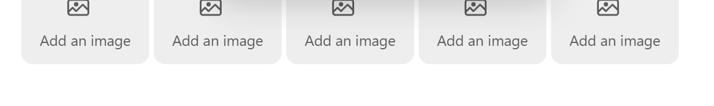

# Better Edit

Better Edit is an Obsidian plugin that adds a Notion-like editing layer to Live
Preview while keeping notes native-first. It improves editing UX without
introducing proprietary storage formats or changing how notes render without the
plugin.

## Features
- **Image arrangement**: portable HTML image blocks, placeholders, resize, align, crop, caption, replace, alt text, copy/duplicate/delete, and first-class multi-image rows
- **Block controls**: drag and drop with left-gutter controls, plus a click menu for delete, duplicate, and conservative Turn into actions
- **Slash commands**: built-in and customizable commands for fast Markdown/HTML block insertion or registered Obsidian command execution
- **Text styling**: selection toolbar for inline formatting, highlighting, equations, code, and links
- **Symbol and emoji picker**: insert math symbols, Greek letters, arrows, and emoji from a context menu, shortcut, or command-palette entry

The release highlight is the native-note storage model: Better Edit's richer image layouts are stored as visible Markdown/HTML. Image rows use ordinary flexbox HTML with inline styles, so notes remain portable and inspectable even when the plugin is disabled.

## Screenshots

| Image toolbar and portable row layouts | Slash commands |
|---|---|
|  |  |
|  |  |

See [docs/feature_list](./docs/feature_list/README.md) for the complete feature reference and additional screenshots.

### Block drag and drop

- Hover a block to reveal the left-gutter add button and drag handle.
- Drag vertically to reorder blocks while preserving Markdown/HTML source.
- Click the drag handle to open a block menu with Delete, Create copy, and Turn into.
- Turn into supports conservative conversions from simple Markdown types such as paragraphs, headings, lists, checkboxes, normal code blocks, and math blocks into V1 targets like paragraphs, headings, lists, checkboxes, and code blocks.
- Tables, image blocks, HTML blocks, callouts, and other complex structures move as whole blocks but are excluded from V1 Turn into conversions.

### Slash commands

- Type a fresh `/` at the beginning of a line to open the slash menu.
- Built-in commands cover headings, lists, checkboxes, quotes, code blocks,
  math blocks, image placeholders, and dividers.
- Commands are reorderable and customizable in settings.

### Text styling

- Select text to open the inline formatting toolbar.
- Supports bold, italic, strikethrough, highlight, inline code, inline equation,
  wiki links, and markdown links.

### Image arrangement

- Paste, drop, or insert image placeholders into the note.
- Resize, align, crop, add captions, replace the source, and set alt text directly in Live Preview.
- Create and edit multi-image rows for comparisons, galleries, and figure groups.
- Drag images into rows, reorder row items, move row items between rows, or pop a row item back out as a standalone block.
- Store rich layout as visible, portable HTML rather than hidden plugin-only data.

### Symbol and emoji picker

- Insert math symbols, Greek letters, arrows, and emoji at the cursor.
- Available from the editor context menu, a plugin-managed shortcut, and an
  Obsidian command.
  
## Installation

### Community Plugins

Community Plugins installation will be available after the plugin is accepted
into the official Obsidian directory.

### Manual install

1. Download `manifest.json`, `main.js`, and `styles.css` from a release.
2. Create `<vault>/.obsidian/plugins/better-edit/`.
3. Copy those three files into that folder.
4. Reload Obsidian and enable **Better Edit** in Community Plugins.

## Compatibility

- Obsidian Live Preview is the primary editing target.
- `manifest.json` currently declares `minAppVersion: 1.5.7`.
- Desktop support is expected.
- Mobile support is not fully verified yet even though the manifest is not
  desktop-only; this should be treated as provisional until tested.

## Disclosures

- No account required
- No telemetry
- No ads
- No paid feature gating
- No network access required for core features
- Edits local note content in the current vault only

## Known limitations

- The plugin is optimized for Live Preview, not Reading View.
- Some interactions depend on current Obsidian editor internals and should be
  regression-tested against new Obsidian releases.
- Regression testing is performed locally before release.

## Documentation

- User-facing feature list: [`docs/feature_list/`](./docs/feature_list/)
- Feature screenshots: [`docs/feature_list/assets/`](./docs/feature_list/assets/)
- Technical architecture and build notes: [`docs/technical.md`](./docs/technical.md)
- Design principles and implementation rationale: [`docs/technical_notes/project-architecture.md`](./docs/technical_notes/project-architecture.md)
- Feature implementation notes: [`docs/technical_notes/`](./docs/technical_notes/)
- Release checklist: [`docs/release-checklist.md`](./docs/release-checklist.md)
- Development rules and Obsidian guidance: [`docs/guidelines.md`](./docs/guidelines.md)

## Development

```bash
npm install
npm run dev
```

Useful commands:

- `npm run build`
- `npm run lint`
- `npm run styles:build`

## License

MIT
