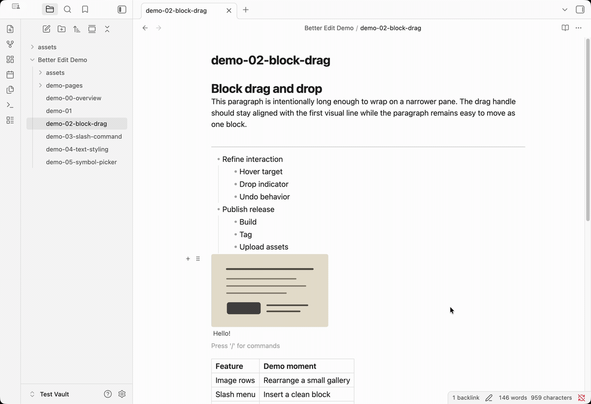
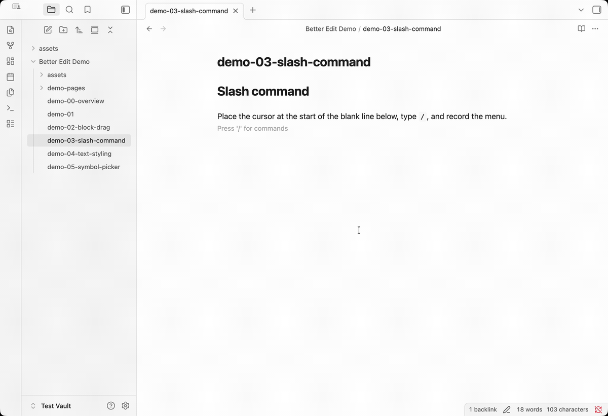

# Better Edit

Better Edit adds a visual editing layer to Obsidian Live Preview while keeping
your notes local, portable, and Markdown/HTML-first. It helps you arrange
images, move blocks, insert reusable structures, style inline text, and add
symbols without turning your notes into a proprietary document format.

## Why Better Edit?

- Work visually in Live Preview instead of hand-editing every Markdown marker.
- Keep notes readable in Source mode, Git diffs, exports, and Obsidian without
  the plugin.
- Use focused editing tools that stay close to the text, image, or block you are
  already working on.

## Features

See [docs/feature_list](./docs/feature_list/README.md) for the complete feature
reference and additional screenshots.

### [Image arrangement](./docs/feature_list/image-arrangement.md)

Use images as part of your writing surface, not as Markdown chores. Paste or
drop an image, resize it, align it, crop it, add captions or alt text, replace
the source, and organize related images into side-by-side rows.

Layouts stay portable. Better Edit saves image blocks and rows as visible
Markdown/HTML with inline styles, so your notes remain readable in Source mode,
Git diffs, exports, and Obsidian without the plugin.

<a href="./docs/feature_list/image-arrangement.md"></a>

<a href="./docs/feature_list/image-arrangement.md"></a>

### [Block drag and drop](./docs/feature_list/block-drag-and-drop.md)

Reshape a note without cutting and pasting source text by hand. Hover near a
block to add nearby content, drag it to a new position, duplicate it, delete it,
or turn simple blocks into other Markdown block types.

Better Edit moves the note content you already have. Normal Markdown structures,
tables, callouts, embeds, HTML blocks, and Better Edit image rows stay as source
text instead of becoming hidden block records.

<a href="./docs/feature_list/block-drag-and-drop.md"></a>

### [Slash commands](./docs/feature_list/slash-commands.md)

Build notes faster from the keyboard. Type `/` on a fresh line to insert common
structures such as headings, lists, checkboxes, quotes, code blocks, math
blocks, image placeholders, and dividers.

Slash commands are also customizable: enable, disable, reorder, and edit them in
settings. Custom entries can insert reusable Markdown/HTML templates or execute
registered Obsidian commands, which makes the menu a fast launcher for both note
structure and existing workflows.

<a href="./docs/feature_list/slash-commands.md"></a>

### [Text styling toolbar](./docs/feature_list/text-styling-toolbar.md)

Format selected text without breaking your writing flow. The floating toolbar
adds bold, italic, strikethrough, highlight, inline code, inline math, wiki
links, and Markdown links from the current selection.

Better Edit writes standard Markdown markers, toggles formatting where possible,
normalizes common nested marks, and includes a link picker for fast revision
work.

<a href="./docs/feature_list/text-styling-toolbar.md"></a>

### [Symbol and emoji picker](./docs/feature_list/symbol-and-emoji-picker.md)

Insert hard-to-type characters without leaving the editor. Open a searchable
picker for math symbols, Greek letters, arrows, comparison operators, and emoji
from the context menu, command palette, or a configurable shortcut.

Everything inserted is ordinary Unicode text, which keeps math notes, research
writing, annotations, and exported Markdown clean and portable.

<a href="./docs/feature_list/symbol-and-emoji-picker.md"></a>

## Installation

### Community Plugins

Community Plugins installation will be available after the plugin is accepted
into the official Obsidian directory.

### Manual install

1. Download `manifest.json`, `main.js`, and `styles.css` from a release.
2. Create `<vault>/.obsidian/plugins/better-edit/`.
3. Copy those three files into that folder.
4. Reload Obsidian and enable **Better Edit** in Community Plugins.

## Compatibility

- Obsidian Live Preview is the primary editing target.
- `manifest.json` currently declares `minAppVersion: 1.5.7`.
- Desktop support is expected.
- Mobile support is not fully verified yet even though the manifest is not
  desktop-only; this should be treated as provisional until tested.

## Disclosures

- No account required
- No telemetry
- No ads
- No paid feature gating
- No network access required for core features
- Edits local note content in the current vault only

## Known limitations

- The plugin is optimized for Live Preview, not Reading View.
- Some interactions depend on current Obsidian editor internals and should be
  regression-tested against new Obsidian releases.
- Regression testing is performed locally before release.

## Documentation

- User-facing feature list: [`docs/feature_list/`](./docs/feature_list/)
- Feature screenshots: [`docs/feature_list/assets/`](./docs/feature_list/assets/)
- Technical architecture and build notes: [`docs/technical.md`](./docs/technical.md)
- Design principles and implementation rationale: [`docs/technical_notes/project-architecture.md`](./docs/technical_notes/project-architecture.md)
- Feature implementation notes: [`docs/technical_notes/`](./docs/technical_notes/)
- Release checklist: [`docs/release-checklist.md`](./docs/release-checklist.md)
- Development rules and Obsidian guidance: [`docs/guidelines.md`](./docs/guidelines.md)

## Development

```bash
npm install
npm run dev
```

Useful commands:

- `npm run build`
- `npm run lint`
- `npm run styles:build`

## License

MIT
