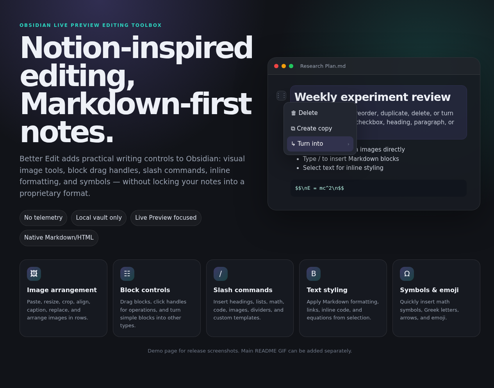

# Better Edit Demo Page

This folder contains a static user-facing demo page for release screenshots and feature explanation.

## Run locally

Open `docs/demo/index.html` in a browser, or from the repo root run a tiny static server:

```bash
python3 -m http.server 4173
```

Then open <http://127.0.0.1:4173/docs/demo/>.

## Current screenshot



The main README GIF can be prepared separately and linked from the README when ready.
