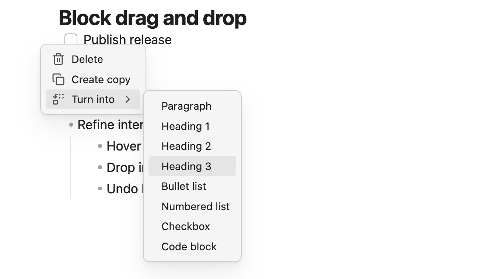

# Block Drag and Drop

Block drag and drop helps you reshape an Obsidian note without falling back to manual cut, paste, and Markdown cleanup. Better Edit adds lightweight controls beside editable blocks so you can add nearby content, move sections, duplicate useful starting points, delete clutter, and convert simple blocks into the structure you need.

Use it while drafting, outlining, revising meeting notes, reorganizing study notes, or turning a rough list of ideas into a cleaner document.

## Why Use It?

Notes change shape as you think. A paragraph needs to move above its explanation, a checklist belongs under a different heading, or a rough line should become a heading before you lose momentum. Block drag and drop keeps those edits in the reading surface, so restructuring feels like part of writing instead of a separate cleanup pass.

## Demo

<a href="./assets/block_drag_n_drop.gif"></a>

The demo shows Better Edit controls appearing beside the current block, then using the drag handle and block menu to reorganize the note directly in Live Preview.

## Block Controls

<a href="./assets/block-controls.png"></a>

The left-gutter controls stay out of the way until you are working near a block. The plus button adds content near the current block, and the drag handle moves the block through the note.

## Turn Into Menu

<a href="./assets/block-turn-into.png"></a>

The block menu handles quick cleanup and conversion. Delete removes the block, Create copy duplicates it, and Turn into changes plain text into common Markdown structures such as headings, lists, checkboxes, and code blocks.

## What You Can Do

- Add a block below the current block.
- Option-click the add control to insert above.
- Drag paragraphs, headings, lists, tables, embeds, and supported HTML blocks to a new position.
- Duplicate a block when you want a nearby variation.
- Delete a block without selecting its source text by hand.
- Turn plain blocks into paragraphs, headings, bullet lists, numbered lists, checkboxes, or code blocks.
- Reorder Better Edit image blocks and image rows as whole blocks.

## Turn Rough Notes Into Structure

Turn into is useful when a note starts as raw text and gains structure later. A brainstorm can become a checklist, a sentence can become a heading, and a short explanation can become a quote or code block. Better Edit rewrites the Markdown markers while preserving the content you wrote.

For example, a nested numbered list can become nested checkboxes while keeping the same indentation and text:

```md
1. Plan release
   1. Run tests
   2. Capture screenshots
```

becomes:

```md
- [ ] Plan release
   - [ ] Run tests
   - [ ] Capture screenshots
```

## Portable by Design

Block drag and drop moves the note content itself. A paragraph remains Markdown text, a list remains a Markdown list, a table remains a table, and an image row remains visible HTML. Better Edit does not create custom block IDs or hidden block storage.

## Notes And Limits

Better Edit is careful around complex Markdown. It moves larger structures as whole blocks when possible, but it avoids conversions that would produce confusing source text. Tables, callouts, blockquotes, embeds, HTML blocks, dividers, and special fenced blocks are better treated as movable blocks than as Turn into targets.
