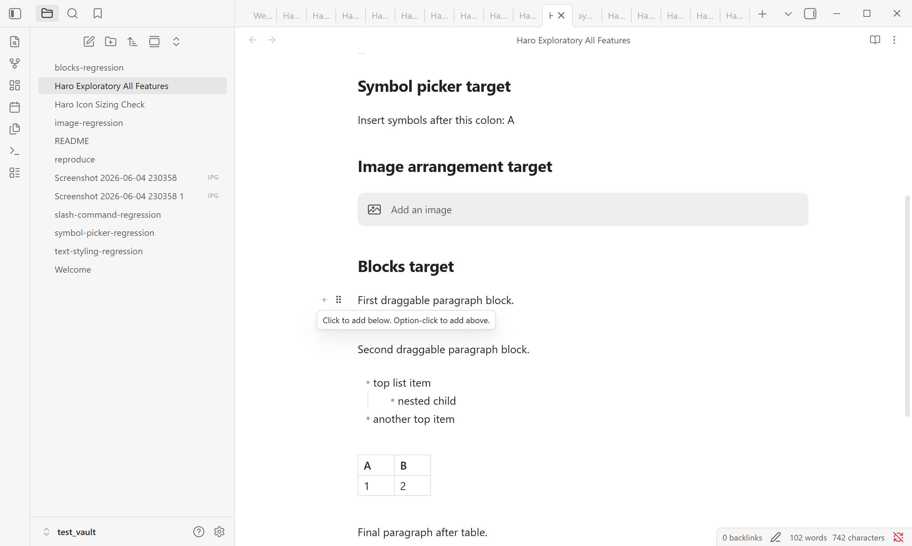

# Block Drag and Drop

Block controls make Obsidian Live Preview easier to rearrange without changing the underlying note format. The feature adds lightweight controls near editable blocks so users can move, add, duplicate, delete, or transform content without manually cutting and pasting Markdown.



## What users see

When the cursor or pointer is near a supported block, Better Edit shows a small left-gutter control group:

- a **plus** control for quickly adding nearby content;
- a **drag handle** for moving the block;
- a block operation menu for actions such as duplicate, delete, and turn into.

The controls appear in the editing surface instead of in a separate side panel, so users can act on the block they are already reading or editing.

## Sub-features

### Hover controls

Hover controls keep the note visually clean most of the time. They appear only when the user is working near a block, reducing permanent UI clutter.

Expected behavior:

- controls align with the current block;
- controls hide when the block is no longer active or hovered;
- controls should not cover the text being edited.

### Add above or below

The plus control supports fast insertion around a block. The current first-release behavior is:

- click to add below;
- option-click to add above.

This helps users build notes from the middle without moving the cursor manually to exact line boundaries.

### Drag to reorder

The drag handle is used to move blocks or list items. This is intended for reorganizing drafts, outlines, meeting notes, and study notes where order changes frequently.

Better Edit should move the corresponding source text rather than creating plugin-only block references.

### Block operation menu

The V1 menu intentionally stays small:

- **Delete** removes the current block or selected simple block range.
- **Create copy** duplicates the current block or selected simple block range.
- **Turn into** converts simple Markdown blocks line-by-line.

Keeping the menu small makes the first release easier to understand and safer to maintain.

### Turn into

Supported Turn into targets:

- Paragraph
- Heading 1
- Heading 2
- Heading 3
- Bullet list
- Numbered list
- Checkbox
- Code block

The transformation rule is conservative:

1. Strip the source block marker.
2. Preserve indentation and text.
3. Apply the target marker line-by-line.

Example: a nested numbered list can become nested checkboxes while keeping indentation intact.

```md
1. Plan release
   1. Run tests
   2. Capture screenshots
```

becomes:

```md
- [ ] Plan release
   - [ ] Run tests
   - [ ] Capture screenshots
```

### Supported simple blocks

Block controls are primarily for normal Markdown writing structures:

- paragraphs;
- headings;
- bullet lists;
- numbered lists;
- checkboxes;
- simple code-like blocks when the selection is unambiguous.

### Stability boundaries

For the first release, Better Edit refuses risky transformations instead of guessing. Turn into is disabled or refused for mixed or structurally complex selections such as:

- tables;
- images and embeds;
- callouts and blockquotes;
- HTML blocks;
- horizontal rules;
- Dataview, Mermaid, or other special fenced blocks.

Normal fenced code blocks and math blocks are treated as code-like text and can be transformed when the selection is unambiguous.

## Native-note promise

Drag and drop moves existing source ranges. Turn into rewrites plain Markdown markers. Better Edit does not add custom block IDs or plugin-only syntax.
