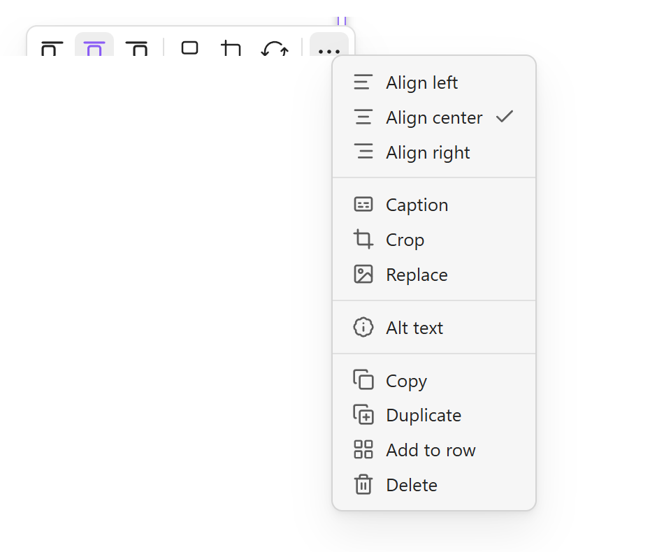
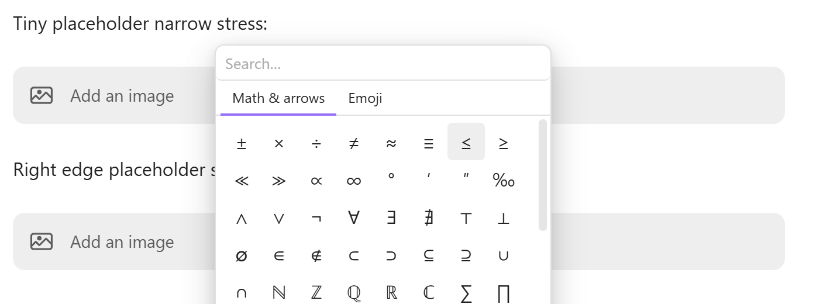

# Image Arrangement

Image arrangement is one of Better Edit's headline features. It turns images into editable parts of the Obsidian Live Preview surface: paste or drop an image, resize it, align it, crop it, add captions and alt text, replace the source, or organize related images into side-by-side rows.

The feature is designed for notes where images are part of the thinking process, not just attachments at the end of a file: research screenshots, design references, before/after comparisons, diagrams, visual study notes, and documentation drafts. Better Edit gives those images direct manipulation controls while still saving the note as Markdown or visible HTML.

## Demo

<a href="./assets/image_edit.gif"></a>

The first demo focuses on editing a single image: opening the image controls, using crop/circle-crop style workflows, and keeping the result attached to the note instead of sending the user to a separate image editor.

<a href="./assets/image_row.gif"></a>

The second demo shows image rows: grouping images, dragging images inside a row, working with captions, and using a row layout for comparison-style notes.

## What users see

When Better Edit recognizes an image block, it adds a compact floating toolbar near the image. The toolbar exposes frequent layout actions directly and keeps secondary actions in an overflow menu.

Typical workflow:

1. Paste, drop, or insert an image in a note.
2. Click or hover the image to reveal Better Edit controls.
3. Use the toolbar to align, resize, crop, caption, replace, or organize the image.
4. Continue writing; the image remains part of the note's normal Markdown/HTML content.

The important design choice is that Better Edit uses **HTML that still renders outside the plugin**. If Better Edit is disabled, the note still contains inspectable `<div>` and `` markup with inline layout styles. That makes image-heavy notes easier to move between Obsidian, Git, VS Code, static-site pipelines, and other Markdown/HTML renderers.

## Supporting visual examples

| Screenshot | What it shows |
|---|---|
|  | Main image toolbar plus the overflow menu: alignment, caption, crop, replace, alt text, copy, duplicate, add to row, and delete. |
|  | The full image action menu in a focused crop. |
|  | Multiple image placeholders arranged in a row. Image rows are a first-class layout feature, not just a side effect of drag-and-drop. |
|  | Placeholder blocks stay visible and usable across narrow and row-based layouts. |

## Sub-features

### Portable HTML image blocks

Better Edit can store rich image layout in visible HTML:

```html
<div data-better-edit-image="filled" style="width: 320px; text-align: center;">
  
  <p style="font-size: 0.85em; color: #888; margin: 4px 0 0;">Diagram caption</p>
</div>
```

This is intentionally boring HTML. The `data-better-edit-image` attribute lets the plugin reopen the visual controls, while the ``, `alt`, caption text, and inline styles remain understandable without Better Edit.

### Image placeholders

Better Edit can show an **Add an image** placeholder for image insertion points. This gives users a visible target for adding an image without remembering Markdown image syntax.

Placeholders are useful when:

- a slash command inserts an image slot;
- a user wants a visual drop/click target;
- a note layout needs images added later;
- a row needs planned image positions before the final files are available.

### Resize handles

Images can be resized visually. Better Edit updates the stored width while preserving the image as note content rather than storing layout in hidden state.

Expected behavior:

- resizing feels immediate in Live Preview;
- the visible image updates in place;
- the saved note remains inspectable and portable;
- crop and resize information stays in the HTML block rather than in plugin-only metadata.

### Alignment controls

The toolbar supports common alignment choices:

- **Align left** for text-leading or narrow images;
- **Align center** for standalone figures;
- **Align right** for side-positioned images when the note layout supports it.

The overflow menu shows the current alignment with a checkmark, so users can see which alignment is active.

### Caption

The caption action lets users add or edit descriptive text attached to an image. Captions are intended for screenshots, diagrams, research images, and visual examples where the image needs context.

Captions are stored as visible HTML text under the image, so they remain readable if Better Edit is disabled.

### Crop and circle crop

Crop opens a focused editing workflow for changing the visible region of an image. It is meant for quick screenshot cleanup and visual note polish without leaving Obsidian.

Crop state is stored in visible HTML styles such as wrapper size, overflow, border radius, and image offset. Circle crop is represented with a circular wrapper (`border-radius: 50%`) rather than with a Better Edit-only image format.

### Replace

Replace lets users keep the image block and its layout/caption context while swapping the underlying image source. This is useful when replacing a draft screenshot with a final screenshot.

Replacement supports vault-local files and typed links. Paths are stored in the note, so the block remains readable as normal Markdown/HTML.

### Alt text

Alt text gives the image a text description for accessibility and for readers who inspect the raw note. Better Edit stores alt text in the image's `alt` attribute.

### Copy, duplicate, and delete

The overflow menu includes maintenance actions:

- **Copy** copies the image block or source reference.
- **Duplicate** creates another copy of the image block.
- **Delete** removes the image block from the note.

These actions are grouped away from the main toolbar so the visible toolbar stays compact.

### Image rows

Image rows arrange multiple images or placeholders side by side. They are important for screenshot comparisons, before/after examples, design alternatives, visual research, and any note where multiple figures should be scanned together.

Rows are stored as a visible HTML flex container:

```html
<div data-better-edit-image-row style="display: flex; gap: 8px; flex-wrap: wrap; align-items: flex-start;">
  <div data-better-edit-image="filled" style="width: 240px; text-align: center;">
    
  </div>
  <div data-better-edit-image="filled" style="width: 240px; text-align: center;">
    
  </div>
</div>
```

Supported row interactions include:

- drag one standalone image onto another to create a row;
- add a standalone image into an existing row;
- reorder images inside a row;
- drag a row image onto a standalone image or placeholder to create a new row;
- drag a row image into another row;
- drag a row image out of a row to pop it out as a standalone block while keeping the remaining source row valid.

### Compact toolbar behavior

When an image or pane is narrow, Better Edit collapses less-common controls into the overflow menu instead of letting a dense toolbar overflow. The main toolbar should stay usable on smaller panes.

## Native-note promise

Better Edit stores image state in standard Markdown image syntax or visible HTML image blocks. HTML blocks may include Better Edit data attributes and inline styles so the plugin can reopen editing controls, but the images, captions, alt text, row layout, and dimensions remain visible and portable without Better Edit.
