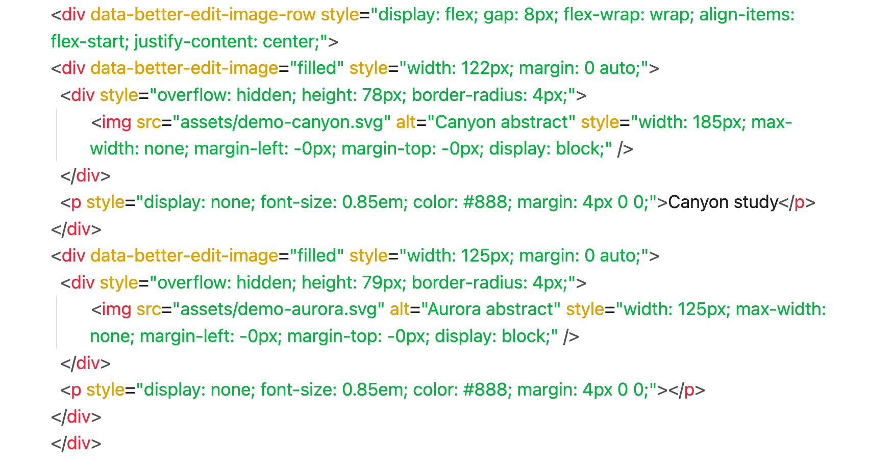
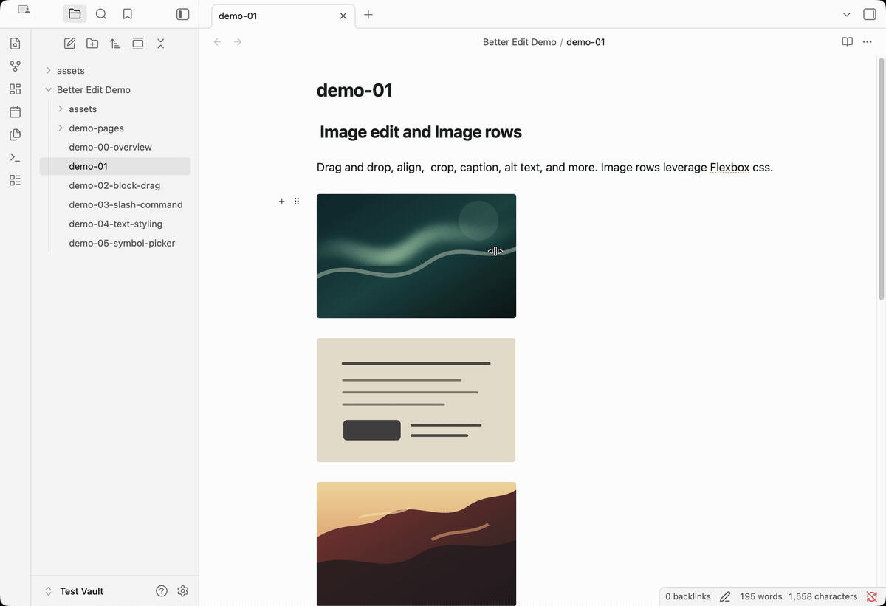
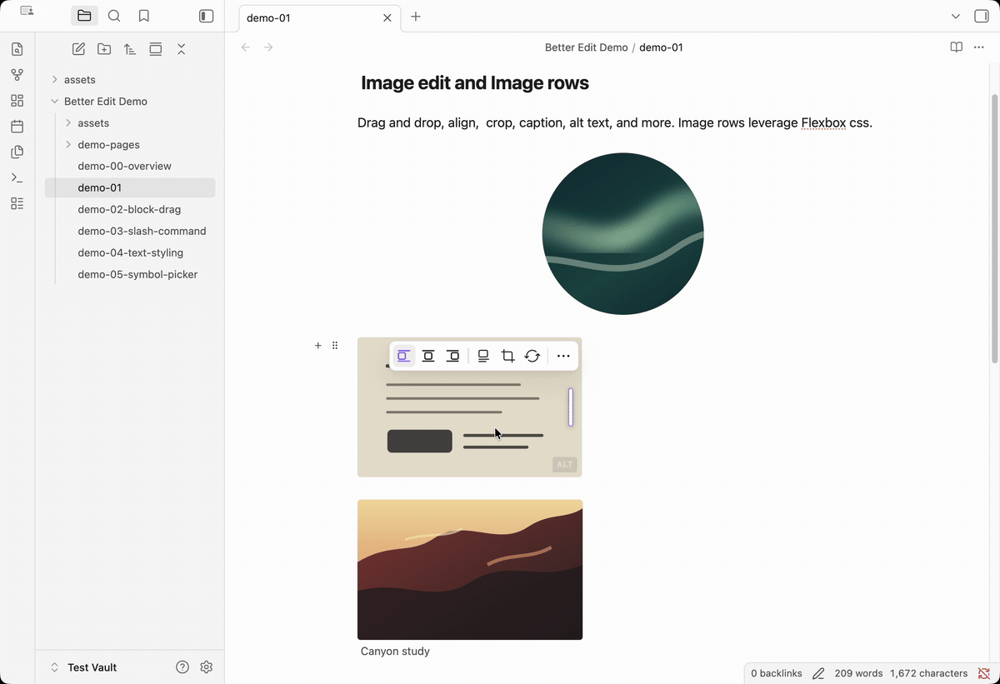
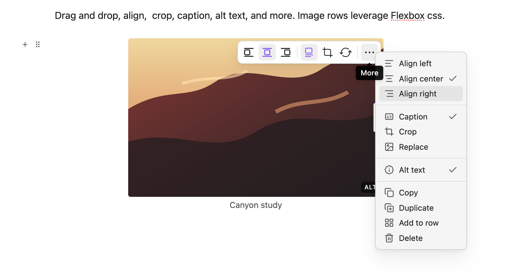
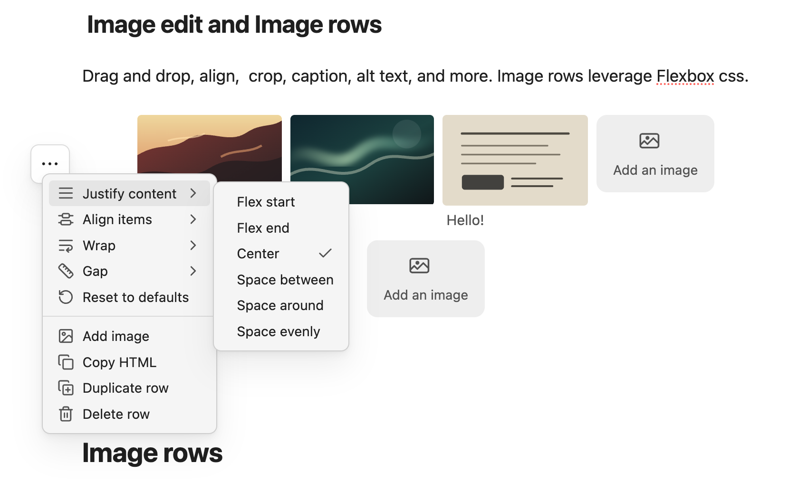
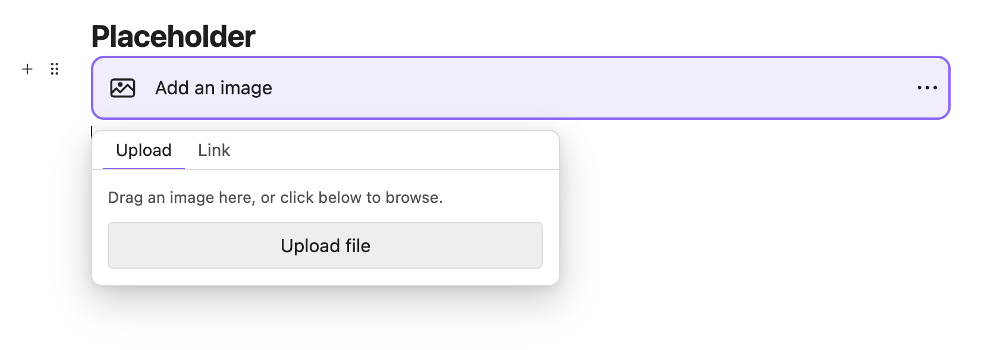

# Image Arrangement

Image arrangement is the feature for notes where images are part of the work, not an attachment afterthought. The key idea is simple: Better Edit gives images visual controls in Obsidian Live Preview, then saves richer layouts as ordinary inline HTML and Flexbox CSS instead of hiding them in private Better Edit data.

Use it for research screenshots, before-and-after comparisons, design references, documentation drafts, diagrams, study notes, and any page where the image layout needs to carry meaning.

## Why Use It?

Obsidian is excellent at storing images, but polished image layout usually means editing Markdown or HTML by hand. Better Edit turns the common actions into direct controls: resize, align, crop, caption, replace, add alt text, duplicate, delete, and group images into comparison rows.

The result is a visual workflow that still saves the note as Markdown or visible HTML.

## Inline HTML and Flexbox CSS

Better Edit's image rows are saved as inline HTML with familiar CSS properties such as `display: flex`, `gap`, `flex-wrap`, `align-items`, and `justify-content`. Single images use the same approach for captions, alt text, crop wrappers, dimensions, and alignment.

That is what makes the feature different from a closed visual editor. You can use a toolbar to build the layout, then inspect or edit the result in Source mode, review it in Git, publish it through Markdown/HTML tools, or keep reading the note when Better Edit is not installed.

## Demo: Single Images

This demo shows the single-image workflow: open the image controls, adjust the visible crop, use circle crop for a focused visual treatment, and keep the result inside the note instead of switching to a separate image editor.

## Demo: Image Rows

Image rows let you group visuals that should be read together. They are useful for screenshot comparisons, design alternatives, tutorial steps, visual research, and figure sets with shared context.

## Image Toolbar

The toolbar keeps frequent controls close to the image and moves secondary actions into the overflow menu. You can align an image, add or edit a caption, crop, replace the source, add alt text, copy, duplicate, add the image to a row, or delete it.

## Image Rows

Rows arrange images and placeholders side by side. Drag standalone images together to create a row, add new images to an existing row, reorder images inside the row, move images between rows, or pull an image back out into a standalone block.

The row menu exposes layout controls such as justification, alignment, wrapping, and gap spacing. Those controls make rows useful beyond simple side-by-side thumbnails: you can create dense comparison strips, centered figure groups, wrapped galleries, or planned layouts with placeholders.

## Image Placeholders

Placeholders give you a visible target before the final image is ready. Insert an image slot from a slash command, drop a file into it, upload from the picker, or paste a link. This is useful when drafting documentation, planning screenshots, or building a visual layout before every asset exists.

## What You Can Do

- Paste, drop, upload, or link an image.
- Resize an image visually while keeping it attached to the note.
- Align standalone images left, center, or right.
- Add captions that remain readable in the note.
- Add alt text for accessibility and clearer source files.
- Crop or circle-crop screenshots and references in place.
- Replace a draft image while preserving the surrounding layout and caption.
- Copy, duplicate, or delete an image block.
- Create image rows for comparisons, galleries, and visual sequences.
- Add placeholders to a row so planned images have a visible slot.

## Portable by Design

Simple images can remain regular Markdown images. Rich image blocks and rows use visible inline HTML so the important content is still present if Better Edit is disabled: image paths, captions, alt text, dimensions, crop styles, and Flexbox row layout. Better Edit may add small attributes so it can reopen controls later, but the note does not depend on hidden plugin storage to show the image.

That makes image-heavy notes easier to inspect in Source mode, review in Git, publish through Markdown/HTML pipelines, and move between devices.

## Notes And Limits

Better Edit favors layouts that remain understandable in Markdown and HTML. Some advanced visual arrangements are represented as HTML blocks because Markdown alone does not have a portable way to express captions, crop wrappers, row alignment, or placeholders.
