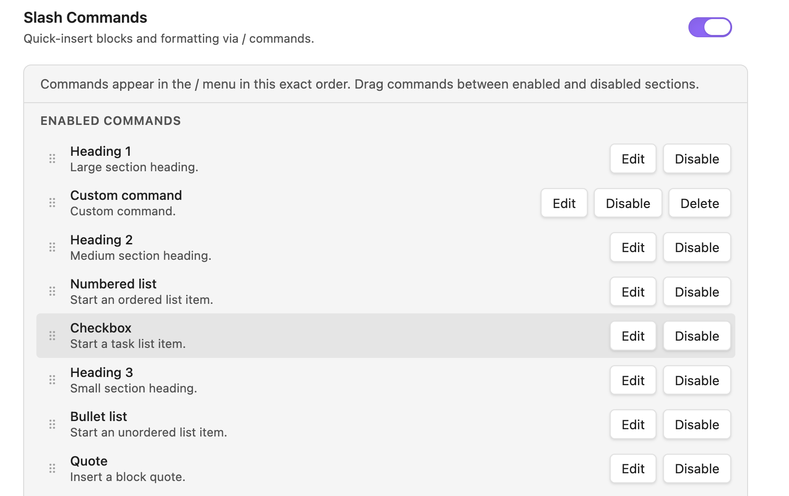

# Slash Commands

Slash commands give Obsidian Live Preview a fast keyboard menu for creating note structure. Type `/` on a fresh line, choose an action, and keep writing.

Use slash commands when you want a heading, list, checkbox, quote, code block, math block, image placeholder, divider, reusable template, or Obsidian command without leaving the editor.

## Why Use It?

Markdown is efficient when the syntax is in your fingers. Slash commands help when you want speed without remembering every marker or moving to a command palette. They are especially useful for building structured notes from the keyboard: meeting notes, lab notes, reading notes, project logs, documentation outlines, and checklists.

## Demo

The demo shows the slash menu opening in the editor, inserting built-in blocks, and using settings to customize what appears in the menu.

## Slash Menu

The menu appears near the cursor after you type `/` on a fresh line. Search by typing after the slash, move through results with the keyboard, press Enter to run a command, or press Escape to close the menu.

## Command Settings

The settings view controls what appears in the slash menu and in what order. You can enable, disable, reorder, edit, and delete custom commands so the menu matches the way you write.

## Built-In Commands

Better Edit includes common Markdown building blocks:

- Heading 1, Heading 2, and Heading 3.
- Bullet list and numbered list.
- Checkbox.
- Quote.
- Code block.
- Math block.
- Image placeholder.
- Divider.

The image placeholder command connects slash commands to image arrangement: create a visible image slot while drafting, then fill it later with an upload, drop, or link.

## Custom Commands

Custom commands turn the slash menu into a small writing launcher. A command can insert a reusable Markdown or HTML template, or it can run a registered Obsidian command.

Template commands are useful for meeting-note scaffolds, reading-note prompts, lab-note sections, project checklists, reusable callouts, and portable image/layout snippets. Templates can include a cursor marker so Better Edit places the caret where writing should continue.

Execute-command entries are useful when you already rely on Obsidian core commands or commands from other plugins. Better Edit clears the slash trigger, runs the selected command, and lets that command handle the result.

## Portable by Design

Template commands insert normal Markdown or visible HTML. Execute-command entries delegate to Obsidian commands instead of storing Better Edit-only output. After a slash command runs, the note contains ordinary note content.

## Notes And Limits

Slash commands are intended for block-level insertion in Live Preview. They work best on a fresh line where the selected command can produce valid Markdown. Contexts such as table cells may not support every block-level result.
