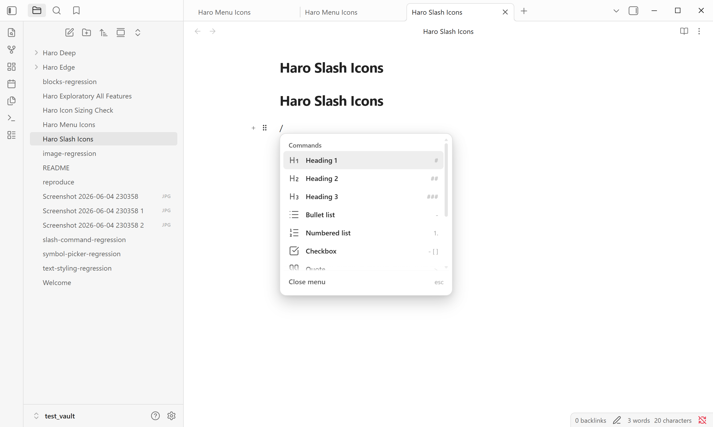

# Slash Commands

Slash commands provide a fast insertion menu for common Markdown blocks. Users type `/` at a valid insertion point, choose a command, and Better Edit inserts the corresponding Markdown or HTML template.

## What users see

Typical workflow:

1. Start on a fresh line in Live Preview.
2. Type `/`.
3. A command menu opens near the cursor.
4. Search or choose an item such as Heading 1, Bullet list, Checkbox, Quote, Code block, or Image.
5. Better Edit replaces the slash trigger with the selected block template and places the cursor where the user should continue typing.

The menu uses readable command names, icons, and a short right-side hint for the Markdown shape that will be inserted.

## Sub-features

### Command menu

The command menu is the main slash-command surface. It should feel like a native Obsidian menu:

- opens near the editor cursor;
- supports keyboard selection;
- highlights the active item;
- closes when the user chooses a command or presses Escape;
- avoids covering more of the note than needed.

### Built-in block commands

The first-release command set covers common Markdown structures:

- **Heading 1** inserts a level-one heading marker.
- **Heading 2** inserts a level-two heading marker.
- **Heading 3** inserts a level-three heading marker.
- **Bullet list** starts an unordered list.
- **Numbered list** starts an ordered list.
- **Checkbox** starts a task item.
- **Quote** inserts a blockquote.
- **Code block** inserts a fenced code block.
- **Math block** inserts a math block.
- **Image placeholder** inserts a visual image slot.
- **Divider** inserts a horizontal rule.

### Search and filtering

Users can narrow the command list by typing after the slash trigger. For example, typing `/head` should focus heading-related commands, and typing `/check` should make the checkbox command easy to choose.

### Keyboard flow

Slash commands are intended to support writing without leaving the keyboard:

- Arrow keys move through results.
- Enter inserts the selected command.
- Escape closes the menu.
- The cursor returns to the inserted block's editable position.

### Custom commands

Users can enable, disable, reorder, and customize slash commands in Better Edit settings. Custom commands use templates and a cursor token so repetitive note patterns can be inserted quickly.

Examples of useful custom commands:

- a meeting-note template;
- a lab-note section;
- a reading-note scaffold;
- a reusable callout or warning block;
- a project-status checklist.

### Context boundaries

Slash commands are intended for normal block insertion in Live Preview. V1 intentionally avoids promising every command in every Markdown context, such as table cells, where many block-level outputs would produce invalid or surprising Markdown.

## Native-note promise

Commands insert plain Markdown or HTML snippets. No command output depends on proprietary storage.
