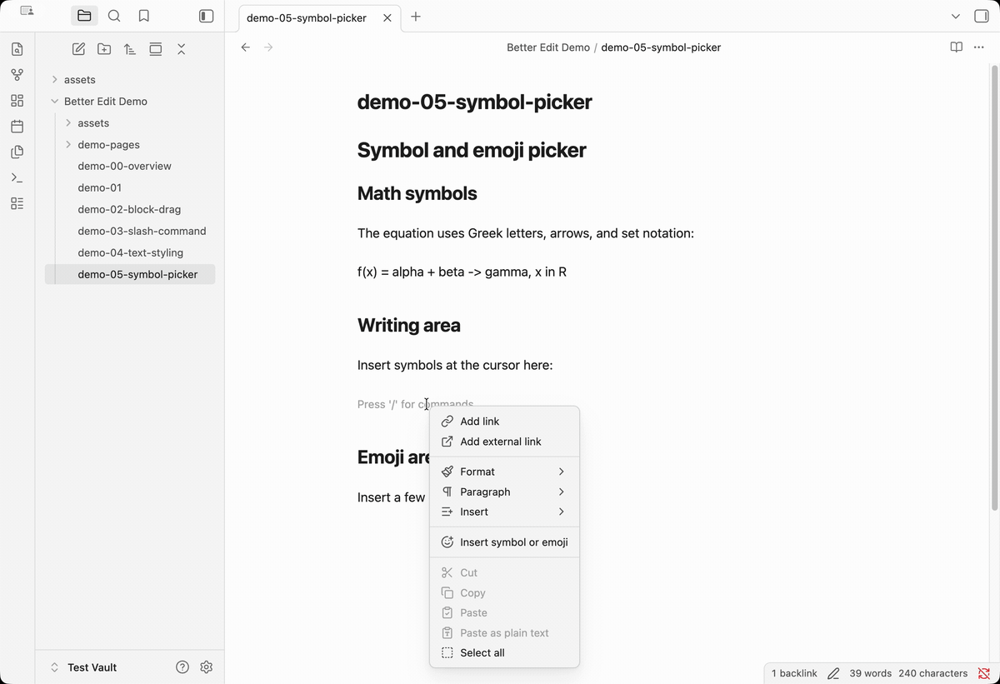
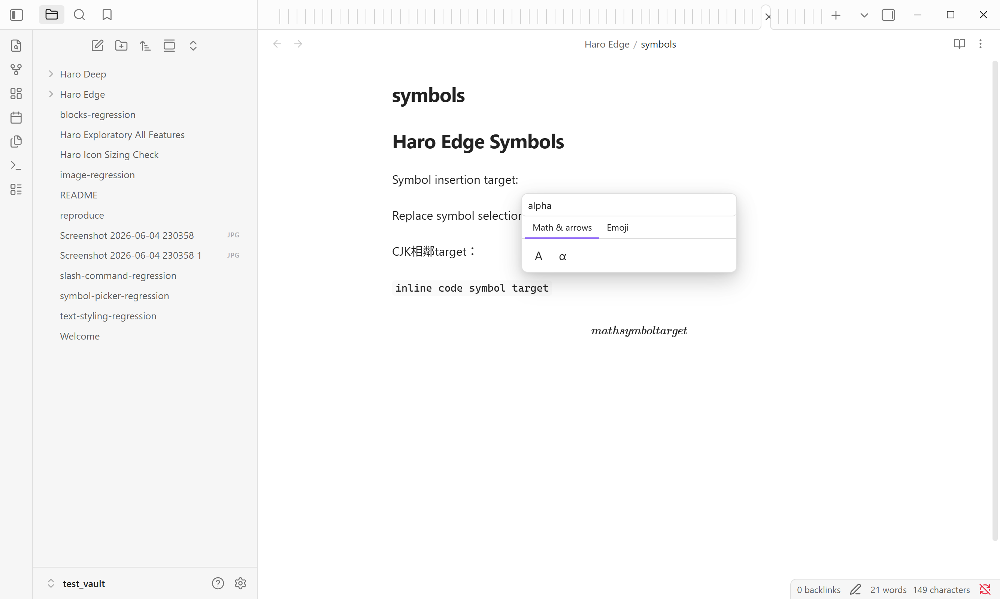

# Symbol and Emoji Picker

The symbol and emoji picker helps you insert characters that are awkward to remember, search for, or type directly. Open the picker, search or browse, choose a symbol, and Better Edit inserts the actual Unicode character into the note.

Use it for math notes, research notes, technical writing, lightweight annotation, and visual markers that should remain readable outside the plugin.

## Why Use It?

Characters like `α`, `≈`, `→`, `≤`, and `∞` are useful in notes, but typing them usually means memorizing shortcuts, copying from another page, or switching tools. The picker keeps those characters available inside Obsidian.

## Demo

The demo shows quick lookup and insertion for both technical symbols and emoji.

## Picker Close-Up

Search filters symbols by name or label. Browsable tabs keep common technical symbols and emoji discoverable even when you do not remember the exact name.

## What You Can Insert

- Greek letters such as `α`, `β`, `γ`, `Δ`, and `Ω`.
- Math operators such as `≈`, `≠`, `≤`, `≥`, `∑`, and `∞`.
- Arrows such as `→`, `←`, `↔`, and `⇒`.
- Emoji for lightweight labels, reactions, and visual markers.

## Entry Points

Open the picker from the editor context menu, an Obsidian command, or a configured shortcut. The shortcut workflow is best for frequent technical writing because it keeps insertion close to the cursor.

## Portable by Design

The picker inserts ordinary Unicode text. Notes remain readable in Markdown, HTML, Git diffs, PDF exports, and other tools wherever the chosen font supports the character.

## Notes And Limits

The picker inserts at the current cursor position. It is meant for characters and emoji, not generated images or custom icon assets.
