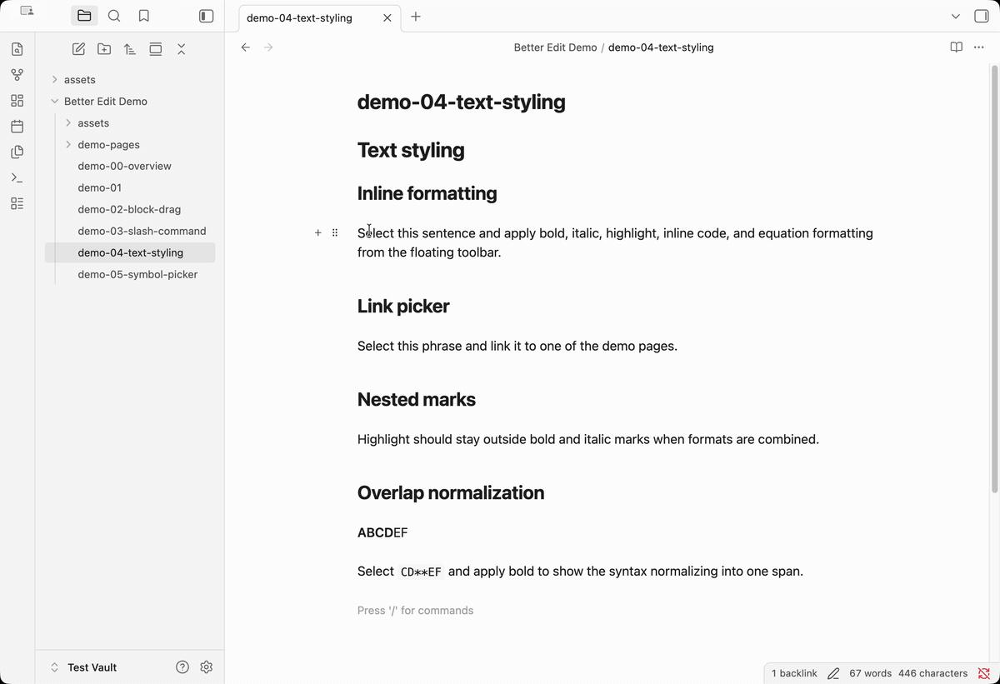
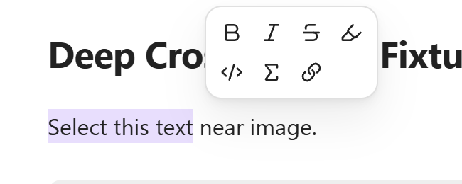

# Text Styling Toolbar

The text styling toolbar makes common inline Markdown formatting available directly from the selection. It is for writers who know the style they want — bold, italic, highlight, inline code, math, or links — but do not want to manually type and balance Markdown delimiters every time.

The toolbar keeps formatting close to the text being edited. Select a phrase, choose an action, and Better Edit writes the standard Markdown markers back into the note. That makes the feature feel visual in Live Preview while keeping the saved file readable in Source mode, Git diffs, exports, and Obsidian without the plugin.

## Demo

<a href="./assets/text_styling.gif"></a>

The demo shows the floating toolbar appearing near selected text, applying inline styles, and using the link workflow for faster editing. The important behavior is that actions write normal Markdown syntax rather than plugin-only rich-text state.

## What users see

Typical workflow:

1. Select text in Live Preview.
2. A floating toolbar appears near the selection.
3. Click a formatting action.
4. Better Edit wraps or unwraps the selected text with standard Markdown syntax.

The toolbar stays compact and close to the selected text. It should help the user continue writing rather than pull them into a large formatting panel.



## Sub-features

### Floating selection toolbar

The toolbar appears when Better Edit detects a usable text selection. It contains common inline formatting actions and hides when the selection is cleared.

Expected behavior:

- appears near the selected text;
- avoids covering the selection when possible;
- flips below the selection if there is not enough space above;
- hides after the action is complete or when the user moves away;
- works with normal Live Preview editing, not only Source mode.

### Bold

Bold wraps the selection in Markdown bold markers.

```md
**selected text**
```

Use for emphasis, important terms, and section-level highlights inside normal paragraphs.

### Italic

Italic wraps the selection in Markdown italic markers.

```md
*selected text*
```

Use for light emphasis, titles, or terminology.

### Strikethrough

Strikethrough wraps the selection with Markdown strikethrough markers.

```md
~~selected text~~
```

Use for revisions, crossed-out alternatives, or visible edits in planning notes.

### Highlight

Highlight wraps the selection with Obsidian/Markdown highlight syntax.

```md
==selected text==
```

Use for study notes, important statements, or review markers.

### Inline code

Inline code wraps the selection in backticks.

```md
`selected text`
```

Use for commands, filenames, identifiers, or short code fragments. V1 keeps inline code single-line so it does not accidentally create malformed Markdown.

### Inline equation

Inline equation wraps the selection in math delimiters.

```md
$selected text$
```

Use for variables, formulas, and mathematical notation inside a sentence.

### Wiki link

Wiki link turns the selection into an Obsidian wikilink.

```md
[[selected text]]
```

Use for connecting notes without manually typing brackets.

### Markdown link

Markdown link turns the selection into link text and prepares the URL portion.

```md
[selected text](https://example.com)
```

Use for standard Markdown links, especially when notes need to remain portable outside Obsidian.

### Toggle and normalization behavior

Where possible, toolbar actions are reversible. If the selected text already has the target formatting, clicking the same action removes that formatting instead of nesting duplicate markers.

Better Edit also normalizes common delimiter runs so combinations stay valid. For example, bold plus italic can become `***text***`, and highlight remains a clean outer wrapper such as `==**important**==`.

## Native-note promise

The toolbar writes standard Markdown inline markers such as `**bold**`, `*italic*`, `~~strike~~`, `==highlight==`, `` `code` ``, `$math$`, `[[wiki links]]`, and standard Markdown link syntax.
